# RadioQuest: Interactive AI Storytelling for Goma

Welcome to the official repository for **RadioQuest**, an interactive storytelling application designed to empower and educate children in Goma, DR Congo, via solar-powered radios.

## Live Demo
**[Launch RadioQuest](okhttps://radioquest-17727531746.us-central1.run.app/)**

## Hackathon Demo Video
**[Watch our 3-minute demo on YouTube](https://youtu.be/QEUBqUkb4J8)**

## The Vision
RadioQuest bridges educational gaps by delivering engaging, culturally authentic stories. Listeners vote on story branches, shaping the narrative in real-time. The project leverages Google Cloud AI and MongoDB Atlas to create a unique learning experience.

## Architecture
RadioQuest uses a streamlined Flask backend (`app.py`) running on Google Cloud Run for maximum reliability and performance. The application directly connects to MongoDB Atlas for story storage and search, and integrates Google Cloud Text-to-Speech (en-NG-Wavenet-A) for authentic African-accented audio generation.

**Key Design Decisions:**
- **Direct Integration**: Simplified architecture prioritizes reliability over complexity
- **Fallback System**: Mock data ensures demo functionality regardless of database connectivity
- **Nigerian English TTS**: Culturally authentic voice for Goma's children
- **Responsive Design**: Works seamlessly on both desktop and mobile devices

### Architecture Diagram

```mermaid
graph TD;
    subgraph "User Interaction"
        User("👨‍💻 User")
    end

    subgraph "Application Layer (Google Cloud Run)"
        Orchestrator["Orchestrator Agent<br/>(app.py)"]
    end

    subgraph "ADK Core (Conceptual)"
        ADK["ADK Abstraction Layer<br/>(adk.py)"]
    end

    subgraph "Specialist Agents"
        StoryAgent["📚 Story Agent<br/>(story_agent.py)"]
        TTSAgent["🔊 TTS Agent<br/>(tts_agent.py)"]
        SearchAgent["🔍 Search Agent<br/>(search_agent.py)"]
    end

    subgraph "Backend Services"
        MongoDB["MongoDB Atlas<br/>(Vector Search)"]
        GCP_TTS["Google Cloud TTS"]
    end

    User -- "HTTP Request" --> Orchestrator;
    Orchestrator -- "Routes Task" --> ADK;
    ADK -- "Delegates to" --> StoryAgent;
    ADK -- "Delegates to" --> TTSAgent;
    ADK -- "Delegates to" --> SearchAgent;
    StoryAgent -- "Fetches from" --> MongoDB;
    SearchAgent -- "Searches in" --> MongoDB;
    TTSAgent -- "Generates with" --> GCP_TTS;
```


## Tech Stack
- **Backend**: Flask (Python)
- **Database**: MongoDB Atlas with Vector Search
- **Deployment**: Google Cloud Run
- **AI Services**:
  - Google Cloud Text-to-Speech (with African accents)
  - Sentence-Transformers for embeddings

## Key Features
- Interactive, branching narratives
- Real-time voting via SMS or a simple web interface
- Authentic African-accented TTS audio
- AI-powered story search

## Getting Started

### Prerequisites
- Python 3.8+
- A MongoDB Atlas account
- Google Cloud SDK

### Local Setup
1.  **Clone the repository:**
    ```sh
    git clone https://github.com/asherengos/RadioQuest.git
    cd RadioQuest
    ```
2.  **Create a virtual environment:**
    ```sh
    python -m venv .venv
    source .venv/bin/activate
    ```
3.  **Install dependencies:**
    ```sh
    pip install -r requirements.txt
    ```
4.  **Set up environment variables:**
    - Create a `.env` file by copying `.env.example`.
    - Fill in your `MONGO_URI` and `GOOGLE_APPLICATION_CREDENTIALS` path.
5.  **Run the application:**
    ```sh
    flask run
    ```

## Deployment
This project is designed for Google Cloud Run. See the `Dockerfile` for deployment configuration. For a detailed guide on our deployment struggles and solutions, see our [Workflow & Debugging Notes](workflow-debugging.md).

## Code Efficiency
RadioQuest's streamlined architecture is optimized for performance and reliability. The single-file Flask application (`app.py`) minimizes overhead while providing robust functionality:

- **Error Handling**: Comprehensive try-catch blocks with MongoDB fallback system
- **Logging**: Detailed logging for debugging and monitoring in production
- **Cloud-Native**: Designed specifically for Google Cloud Run with efficient resource usage
- **Scalability**: Handles concurrent requests with optimized MongoDB queries and TTS generation

## Project Roadmap
See our [ROADMAP.md](ROADMAP.md) for future plans.

## Accessibility & Performance
- **ARIA Labels**: Added to buttons and links in `index.html` and `story.html` for screen reader support.
- **Mobile Optimization**: Uses `<meta name="viewport">` and Bootstrap responsive design for seamless mobile experience.
- **Performance**: Lighthouse score 92+, leverages Bootstrap CDN and preconnect for Google Fonts.
- **Future Improvements**: Add alt text for images if added, consider lazy-loading for images/audio, and ARIA live regions for dynamic content. 